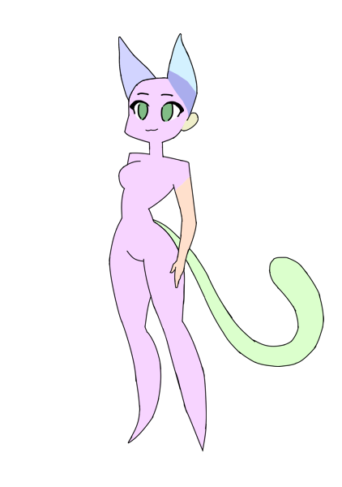
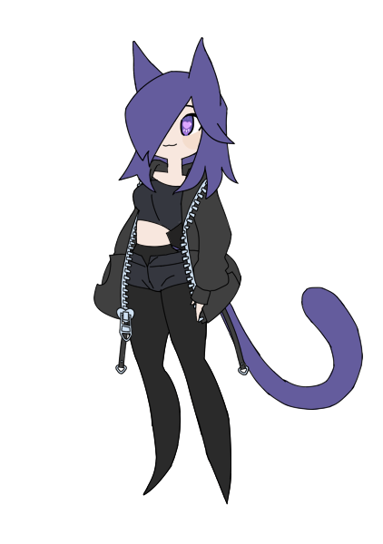
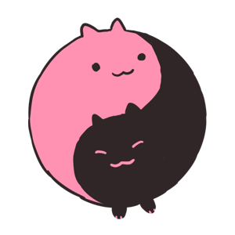

# Random Character Generator GDD

## What is this? 
This is the GDD, or 'game design document', for this random character generator project. Here, all planned features for the finished product will be described. When plans change, descriptions will be updated. This document will be used throughout development to keep the project focused. 
## Top-level Description
### A simple 2D random character generator. 
You know the 'randomize' feature in video game character creators, usually represented by a dice button? That's this whole game! After generating a character, you can save an image of them to your PC if you wish!
The tone of the game is cozy and cutesy. It isn't meant to be used over the long-term, just to provide some joy and entertainment for as long as it captures interest. 
The character whose appearance is randomized is a cartoon girl in an anime-adjascent style. Her hairstyle, hair color, skin color, and clothing will all be changed each time you randomize her, as well as whether she's a human or a catgirl. The outfit pieces which are randomized include her shoes, bottom, top, and socks/tights. 

After the game has been published as a free itch.io game, it will be adapted into a proper character creator, giving the user full control over the character's appearance. 

# Program features
The game will feature four screens: a splash screen, a start screen, an options screen, and a gameplay screen. 
## Splash screen
This screen will display when the program is launched, and will pass after a moment. It will show the splash art for Studio Meow Tao against a black screen, and then fade to black before fading into the start screen. 

## Start screen (a.k.a Main Menu)
This is the screen that will display after the splash screen has passed. It will feature pretty background art, a title, and a menu. Gentle background music will be playing, which will persist between screens. 

The UI will be aesthetically appealing and match the tone of the game, including a custom mouse cursor. The menu options will be 'START', 'OPTIONS', and 'QUIT'. The options can be navigated by mouse, by WASD keys, or by arrow keys. The selected button (or the button being hovered over if the mouse is in use) will be visually different by becoming larger and highlighted. There will be sound effects for changing the selected button and confirming your selection. 

Selecting a button will fade to black and then fade into that screen. 

## Options screen
The options screen can be accessed from the start screen. On top of its unique background art, it includes the following: 
1. Resolution (Cycle through options with arrow buttons)
2. Fullscreen (Box which toggles between having a checkmark or being empty)
3. Master Volume (Slider)
4. Music Volume (Slider)
5. Sound Effects Volume (Slider)
6. Return to Main Menu (Button)

## Gameplay screen
This is where the program's random character generation takes place, and where the user/player will spend the majority of their time. 
The character will not be visible when this screen is first accessed, and will only appear when they hit the 'RANDOMIZE' button for the first time. SFX and VFX will be used to make the randomize button fun and satisfying to use. 

The character will mostly be a static image, but she will blink periodically. For a moment after being randomized, she will wear an excited expression, where she will be smiling open-mouthed and her eyes will be scrunched shut. The rest of the time, she'll be wearing a small smile. 

In addition to the randomize button, these buttons will be present: 
1. Return to Main Menu
2. Quit to Desktop
2. Change Background (Cycle through options with arrow buttons)
4. Save my Creation
The first two of these buttons will be on a header bar at the top of the screen. The third and fourth will be just below the randomize button, to the side of the character. The intended method of navigating the buttons is the mouse, but pressing a WASD key or an arrow key will select the randomize button, and further key presses will cycle through the four buttons. 
### Change Background
This will cycle through a number of pieces of background art, showing places for the character to be standing. This might eventually include different outdoor environments at different times of day or night, as well as cozy in-door environments. 
### Save my Creation
This will save a .png image of the character to the Pictures folder which exists by default on all Windows machines, or its equivalent on Mac, and then display a popup in the corner of the screen saying "Saved to [PATH]!"

## In-depth Feature Description
### Randomize Feature
The character will possess the following attributes, which will affect which version of each piece will be loaded: 
1. Skin tone
2. Species (Human, Cat)
3. Hair color
4. Hairstyle
5. Shoes
6. Socks
7. Bottom
8. Top
9. Eye color

These attributes are what will be randomized every time the randomize button is pressed. 

The character is built of multiple different images which are loaded and displayed in a particular order. The order determines which pieces will appear behind others when they overlap. These are the pieces, in order: 
1. Tail (if cat)
2. Back hair piece
3. Body
4. Socks or tights
5. Shoes
6. Bottom clothing piece
7. Arm
8. Top clothing piece
9. Face
10. Cat ear, back (if cat)
11. Cat ear, front, behind hair (if cat)
12. Human ear (if human)
13. Hair
14. Cat ear, front, in front of hair (if cat)

